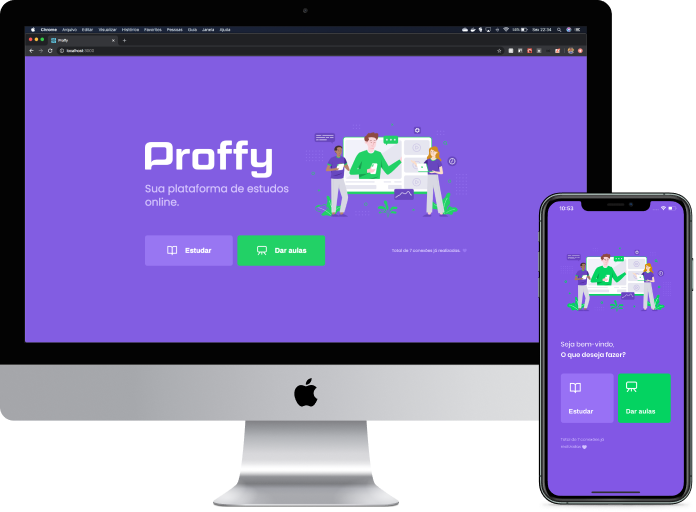

<h1 align="center">
    
    <p>
     
    </p>
</h1>

## 💻 Projeto

A proposta é criar uma plataforma para conectar professores e alunos.

## 🔖 Layout


Você pode baixar o layout do projeto no formato `.fig`

- [Web](.github/Proffy_Web.fig).
- [Mobile](.github/Proffy_Mobile.fig).

Para abrir o arquivo no formato `.fig` em qualquer sistema operacional utilize a ferramenta [Figma](https://figma.com).

## :rocket: Tecnologias

Esse projeto foi desenvolvido com as seguintes tecnologias:

#### NodeJs

- cors
- express
- knex
- sqlite3
- ts-node
- typescript

#### ReactJs

- axios
- react-icons
- react-router-dom
- react-icons
- typescript

#### React Native (Expo)

## :information_source: Como usar

```bash
# Clone o repositório
$ git clone https://github.com/DanAraujjo/nlw-02-proffy
$ cd nlw-02-proffy

## Servidor
$ cd server
# Instale as dependências
$ yarn install
# Inicie o projeto
$ yarn start

## Web
$ cd web
# Instale as dependências
$ yarn install
# Inicie o projeto
$ yarn start

## Mobile
$ cd mobile
# Instale as dependências
$ yarn install
# Inicie o projeto
$ yarn start
```

## 🤔 Como contribuir

- Faça um fork desse repositório;
- Cria uma branch com a sua feature: `git checkout -b minha-feature`;
- Faça commit das suas alterações: `git commit -m 'feat: Minha nova feature'`;
- Faça push para a sua branch: `git push origin minha-feature`.

Depois que o merge da sua pull request for feito, você pode deletar a sua branch.
